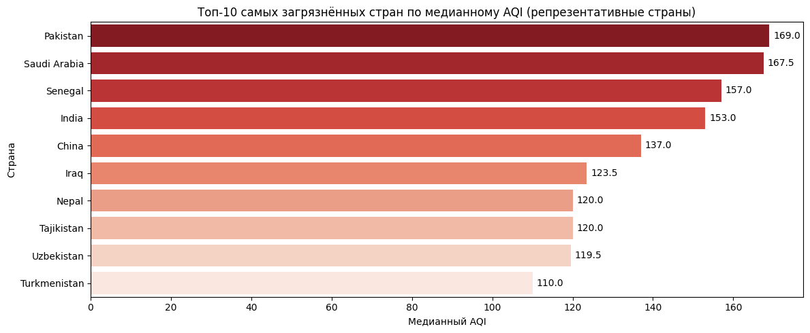
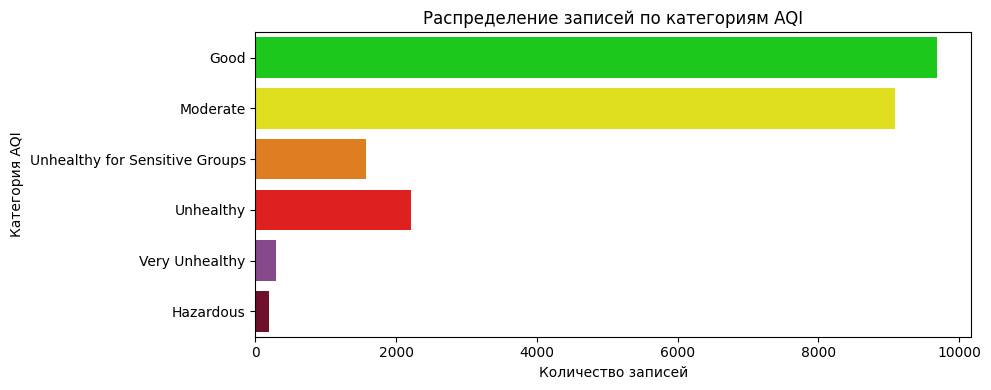
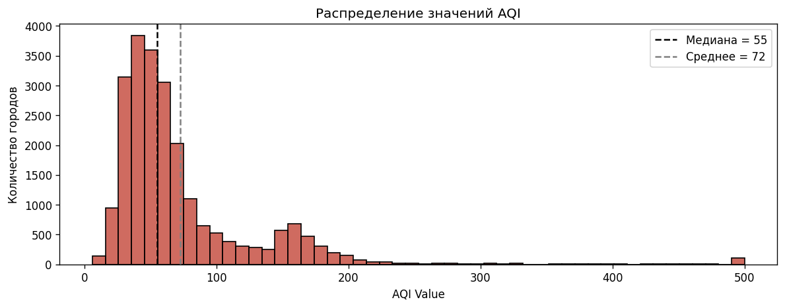

# 🌍 Анализ качества атмосферного воздуха в мировом масштабе

*EDA • Data Cleaning • SQL • Data Visualization*




*Топ-10 стран по медианному AQI после исключения стран с малым числом наблюдений.*

Исследовательский анализ качества воздуха в 23 000+ городах мира. Проект направлен
на выявление наиболее загрязнённых регионов, определение доминирующих загрязнителей
и построение воспроизводимого аналитического pipeline — от очистки данных до
визуальных выводов.

## О проекте

EDA по данным о качестве воздуха в 23 000+ городах мира, отвечающий на конкретные
исследовательские вопросы, а не просто «осматривающий» данные.

**Основные вопросы исследования:**

1. Какие страны имеют наиболее высокий медианный AQI?
2. Какие загрязнители чаще всего связаны с высоким индексом AQI?
3. Насколько результаты зависят от количества наблюдений по стране?
4. Какие ограничения есть у исходных данных?

> **Ключевой аналитический подход.** Из-за сильной правосторонней асимметрии
> распределения AQI среднее могло искажать сравнение стран — поэтому для рейтингов
> использовалась **медиана**.

**Pipeline:**

```
Data Loading
   ↓
Data Quality Check
   ↓
Cleaning & Validation
   ↓
Exploratory Data Analysis
   ↓
SQL Aggregations
   ↓
Statistical Analysis
   ↓
Visualization & Insights
```

## Что демонстрирует проект

- ✔ **pandas** — очистка, агрегации, описательная статистика
- ✔ **SQL (SQLite)** — агрегаты, группировки, CTE и оконные функции для аналитических запросов
- ✔ Работа с пропусками и дубликатами
- ✔ **Медиана вместо среднего** при асимметрии распределения
- ✔ Проверка экстремальных значений и ограничений шкалы AQI, фильтрация нерепрезентативных выборок
- ✔ Визуализация (matplotlib / seaborn)
- ✔ Формулировка ограничений данных

**Реализованные SQL-запросы:**

- подсчёт доли городов по категориям AQI (оконная функция);
- ранжирование городов внутри стран по AQI;
- рейтинг стран по доле «нездоровых» городов (CTE);
- проверка гипотезы о доминирующем загрязнителе.

## Основные выводы

- Большинство наблюдений (≈ 83 %) относятся к категориям *Good* и *Moderate*.
- После исключения стран с менее чем 10 наблюдениями наивысший медианный AQI
  у **Пакистана (169)** и **Индии (153)**.
- Города с максимальным AQI в датасете (Bahawalnagar, Rania, Gohana, Gunnaur,
  Harunabad) достигают потолка шкалы — **AQI = 500**.
- В городах с максимальным AQI основным указанным загрязнителем является **PM2.5**
  (его AQI-субиндекс — 443–500).

## Стек

| Инструмент | Для чего в проекте |
|---|---|
| **Python 3.12 (pandas)** | очистка, агрегации, описательная статистика |
| **SQL (SQLite)** | агрегаты, группировки, CTE и оконные функции (`queries.sql`) |
| **matplotlib / seaborn** | визуализация распределений и рейтингов |
| **Jupyter Notebook** | среда проведения анализа |

## Визуализации

Топ-10 стран по медианному AQI:


Распределение записей по категориям AQI:



Распределение значений AQI (длинный правый хвост — причина выбора медианы):



## Как запустить

```bash
git clone https://github.com/TamagotchiFibi/air-pollution-eda.git
cd air-pollution-eda
pip install -r requirements.txt
jupyter notebook air_quality_eda.ipynb
```

**Данные:** [Kaggle — Global Air Pollution Dataset](https://www.kaggle.com/datasets/hasibalmuzdadid/global-air-pollution-dataset)
(23 000+ городов). Файл `air_pollution.csv` (небольшой, ~2 МБ) включён в
репозиторий для воспроизводимости.

## Структура репозитория

```
air-pollution-eda/
├── air_quality_eda.ipynb   # основной анализ (Jupyter)
├── air_pollution.csv        # датасет
├── queries.sql              # аналитические SQL-запросы (реальные, не заглушки)
├── images/                  # экспортированные графики
├── requirements.txt
└── README.md
```

## Ограничения

- Данные — единичный временной срез, динамика не оценивается.
- Не учитываются погодные условия, сезонность и численность населения.
- Данные могут отражать неравномерное покрытие стран и городов.
- AQI — агрегированный индекс и не заменяет измерения концентраций отдельных веществ.
- Часть стран представлена малым числом наблюдений.